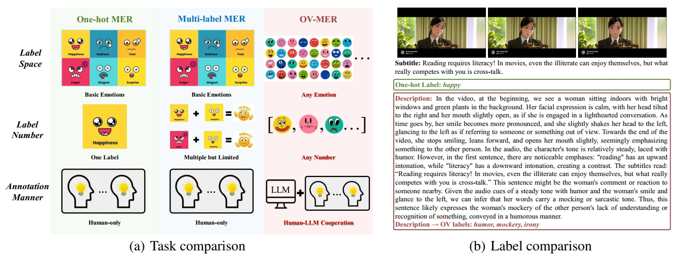
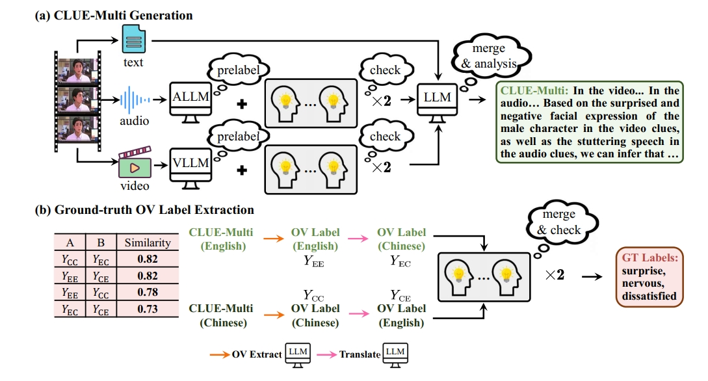
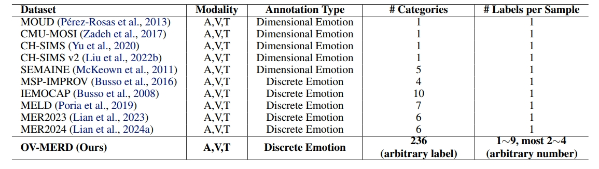
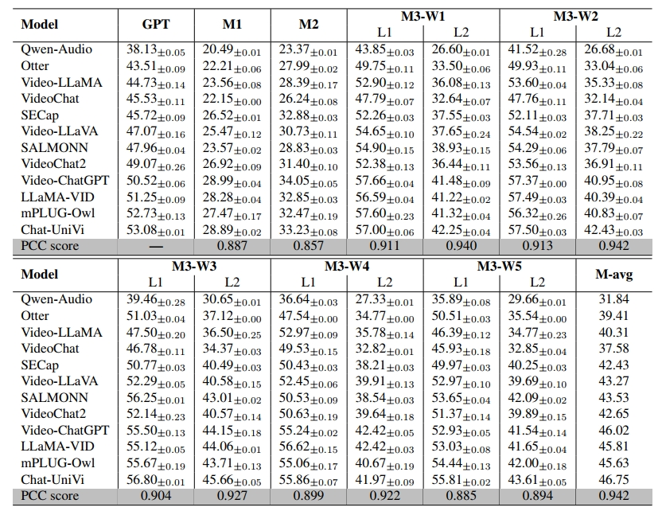

<p align="center">
    
<p>

<h3 align="center"><a href="https://arxiv.org/abs/2410.01495" style="color:#9C276A">
OV-MER: Towards Open-Vocabulary Multimodal Emotion Recognition</a></h3>
<h5 align="center"> If our project helps you, please give us a star ⭐ on GitHub to support us. 🙏🙏 </h2>

<h5 align="center">

[](LICENSE) 
[](https://arxiv.org/abs/2410.01495) <br>

</h5>


## ✨ OV-MER Task

**OV-MER** transitions from *traditional MER* to a framework that enables the prediction of *any number and category of emotions*, thereby advancing emotion AI toward real-world applicability by capturing the full spectrum of human emotions.

**(a) Task Comparison**: We compare the differences among three tasks (one-hot MER, multi-label MER, and OV-MER) across three aspects (label space, label number, and annotation manner).

**(b) Label Comparison**: We provide an example to visualize the one-hot and OV labels.




## 🚀 OV-MERD Dataset

We construct the first dataset for the OV-MER task. We use a human-LLM collaboration strategy for dataset construction, obtaining the **OV-MERD** dataset.

<p></p>

**OV-MERD** dataset contains 236 emotion categories and most samples have 2 to 4 labels, far exceeding those in current datasets.
<p></p>


This dataset is available at: https://huggingface.co/datasets/MERChallenge/MER2025
```bash
dataset
├── mer2025-dataset
|   ├── video # all training data, including 132,171 samples
|   ├── audio # pre-extracted audio
|   ├── openface_face # # pre-extracted face files
|   ├── subtitle_chieng.csv # pre-extracted subtitle content
|   ├── track2_train_ovmerd.csv # OV-MERD Dataset (OV labels)
|   ├── track3_train_ovmerd.csv # OV-MERD Dataset (Description)
```


## 🛠️ Requirements and Installation
My Dependencies (We have not tested other envs):
* CUDA Version == 12.1

**[Environment Preparation]**
```bash
# We need different envs for different MLLM baselines
conda env create -f environment_vllm2.yml
conda env create -f environment_whisperx.yml
```


## 🗝️ Inference

### Data and Pre-trained Checkpoints Structure
```bash
dataset
# MERCaption+ available at: https://huggingface.co/datasets/MERChallenge/MER2025
├── mer2025-dataset
|   ├── video # all training data, including 132,171 samples
|   ├── audio # pre-extracted audio
|   ├── openface_face # # pre-extracted face files
|   ├── subtitle_chieng.csv # pre-extracted subtitle content
|   ├── track2_train_ovmerd.csv # OV-MERD Dataset (OV labels)
|   ├── track3_train_ovmerd.csv # OV-MERD Dataset (Description)

OV-MER
├── models # We put all pre-trained baselines weights to: https://pan.baidu.com/s/1KHL1oGCtvqr8IMNWDWxH3Q?pwd=djjw
│   ├── bert-base-uncased
│   ├── Chat-UniVi
│   ├── clip-vit-large-patch14
│   ├── LanguageBind_Image
│   ├── ...
```

### Inference Code

Please change *xxx* in *DATA_DIR* to your own root. All results are stored in **./output**.

```bash
# vllm2
conda activate vllm2
cd Qwen-Audio
CUDA_VISIBLE_DEVICES=0 python main-audio.py --subtitle_flag='subtitle'   --dataset='OVMERD'
CUDA_VISIBLE_DEVICES=0 python main-audio.py --subtitle_flag='nosubtitle' --dataset='OVMERD'
cd SALMONN
CUDA_VISIBLE_DEVICES=0 python main-audio.py --subtitle_flag='subtitle'   --dataset='OVMERD'
CUDA_VISIBLE_DEVICES=0 python main-audio.py --subtitle_flag='nosubtitle' --dataset='OVMERD'
cd Video-ChatGPT
CUDA_VISIBLE_DEVICES=0 python main-video.py --subtitle_flag='subtitle'   --dataset='OVMERD'
CUDA_VISIBLE_DEVICES=0 python main-video.py --subtitle_flag='nosubtitle' --dataset='OVMERD'
cd Chat-UniVi
CUDA_VISIBLE_DEVICES=0 python main-video.py --subtitle_flag='subtitle'   --dataset='OVMERD'
CUDA_VISIBLE_DEVICES=0 python main-video.py --subtitle_flag='nosubtitle' --dataset='OVMERD'
cd mPLUG-Owl
CUDA_VISIBLE_DEVICES=0 python main-video.py --subtitle_flag='subtitle'   --dataset='OVMERD'
CUDA_VISIBLE_DEVICES=0 python main-video.py --subtitle_flag='nosubtitle' --dataset='OVMERD'
cd Otter
CUDA_VISIBLE_DEVICES=0 python main-video.py --subtitle_flag='subtitle'   --dataset='OVMERD'
CUDA_VISIBLE_DEVICES=0 python main-video.py --subtitle_flag='nosubtitle' --dataset='OVMERD'
cd VideoChat
CUDA_VISIBLE_DEVICES=0 python main-video.py --subtitle_flag='subtitle'   --dataset='OVMERD'
CUDA_VISIBLE_DEVICES=0 python main-video.py --subtitle_flag='nosubtitle' --dataset='OVMERD'
cd VideoChat2
CUDA_VISIBLE_DEVICES=0 python main-video.py --subtitle_flag='subtitle'   --dataset='OVMERD'
CUDA_VISIBLE_DEVICES=0 python main-video.py --subtitle_flag='nosubtitle' --dataset='OVMERD'

# whisperx
conda activate whisperx
cd LLaMA-VID
CUDA_VISIBLE_DEVICES=0 python main-video.py --subtitle_flag='subtitle'   --dataset='OVMERD'
CUDA_VISIBLE_DEVICES=0 python main-video.py --subtitle_flag='nosubtitle' --dataset='OVMERD'
cd Video-LLaVA
CUDA_VISIBLE_DEVICES=0 python main-video.py --subtitle_flag='subtitle'   --dataset='OVMERD'
CUDA_VISIBLE_DEVICES=0 python main-video.py --subtitle_flag='nosubtitle' --dataset='OVMERD'
```

### Clue Merging 
We also provide a demo code to merge subtitle and clues.
```bash
conda activate vllm2
python merge.py
```

## 👍 Score Calculation

1. If you want to skip the above inference process, we also provide intermedia outputs for evaluation.
```bash
[1] prepare results # Available in current github
OV-MER
├── output
│   ├── results-ovmerd
│   │   ├── Chat-UniVi
│   │   ├── LLaMA-VID
│   │   ├── mPLUG-Owl
│   │   ├── ...

[2] score calculation: ov labels + gt labels => score
CUDA_VISIBLE_DEVICES=0 python evaluation-scoreonly.py
# output format: M1, M2, M3W1-L1, M3W1-L2, ...,  M3W5-L1, M3W5-L2
```

2. Full evaluation code
```bash
conda activate vllm2
CUDA_VISIBLE_DEVICES=0 python evaluation.py
```

Since the emotion labels extracted in different runs are slightly different, the results may differ slightly from those reported in our paper.
<p></p>


## 📑 Citation

If you find OV-MER useful for your research and applications, please cite using this BibTeX:
```bibtex
@article{lian2024ov,
  title={OV-MER: Towards Open-Vocabulary Multimodal Emotion Recognition},
  author={Zheng Lian, Haiyang Sun, Licai Sun, Haoyu Chen, Lan Chen, Hao Gu, Zhuofan Wen, Shun Chen, Siyuan Zhang, Hailiang Yao, Bin Liu, Rui Liu, Shan Liang, Ya Li, Jiangyan Yi, Jianhua Tao},
  journal={ICML},
  year={2024}
}
```

## 👍 Acknowledgement
We evaluate the performance of various LLM-based baselines on OV-MERD, including [**SECap**](https://github.com/thuhcsi/SECap), [**SALMONN**](https://github.com/bytedance/SALMONN), [**Qwen-Audio**](https://github.com/QwenLM/Qwen-Audio), [**Otter**](https://github.com/Luodian/Otter), [**OneLLM**](https://github.com/csuhan/OneLLM), [**PandaGPT**](https://github.com/yxuansu/PandaGPT), [**VideoChat**](https://github.com/OpenGVLab/Ask-Anything/tree/main/video_chat), [**VideoChat2**](https://github.com/OpenGVLab/Ask-Anything/tree/main/video_chat2), [**Video-LLaMA**](https://github.com/DAMO-NLP-SG/Video-LLaMA), [**Video-LLaVA**](https://github.com/PKU-YuanGroup/Video-LLaVA), [**Video-ChatGPT**](https://github.com/mbzuai-oryx/Video-ChatGPT), [**LLaMA-VID**](https://github.com/dvlab-research/LLaMA-VID), [**mPLUG-Owl**](https://github.com/X-PLUG/mPLUG-Owl), and [**Chat-UniVi**](https://github.com/PKU-YuanGroup/Chat-UniVi). We extend our gratitude to the authors for their excellent work.


## 🔒 License

This project is released under the Apache 2.0 license as found in the LICENSE file. The service is a research preview intended for **non-commercial use ONLY**. Please get in touch with us if you find any potential violations.
